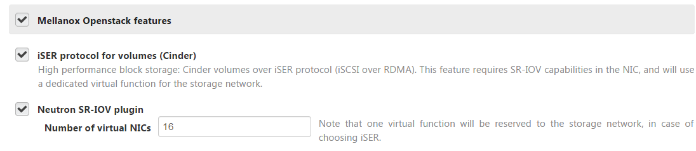
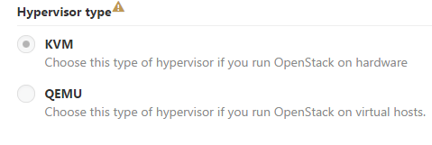
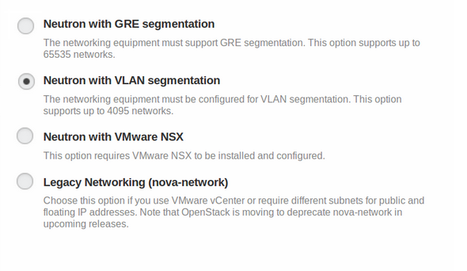
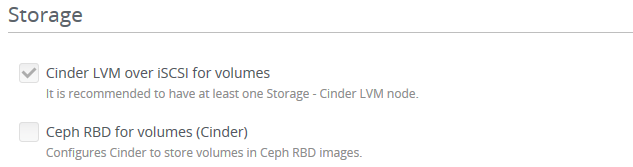

.. _configuration:

Mellanox plugin configuration
------------------------------

To configure Mellanox backend, follow these steps:

**Ethernet network:**

Configure the required VLANs and enable flow control on the Ethernet switch ports. All related VLANs should be enabled on the 40/56GbE switch (Private, Management, Storage networks). On Mellanox switches, use the commands in Mellanox `reference configuration <https://community.mellanox.com/docs/DOC-1460>`_, flow to enable VLANs (e.g. VLAN 1-100 on all ports). An example of configuring the switch for Ethernet deployment can be found in `Mirantis planning guide <https://docs.mirantis.com/openstack/fuel/fuel-7.0/planning-guide.html#planning-guide>`_.

For instructions, more information and release notes, see the Mellanox Plugin installation Guide in the `Fuel Plugins Catalog <https://www.mirantis.com/products/openstack-drivers-and-plugins/fuel-plugins/>`_.

Environment creation and configuration
------------------------------------------------------

Create an environment – for more information please see `how to create an environment <https://docs.mirantis.com/openstack/fuel/fuel-7.0/user-guide.html#create-a-new-openstack-environment>`_

a. Open the Settings tab of the Fuel web UI and scroll down the page. In Mellanox OpenStack features section, select the required features.

.. :alt: A screenshot of mellanox features section

b. In  SR-IOV feature supports only KVM hypervisor

..   :alt: A screenshot of hypervisors type
With Neutron with VLAN segmentation.

..   :alt: A screenshot network type

c. The iSER feature requires “Cinder LVM over iSCSI for volumes” enabled in the “Storage” section.

..   :alt: A screenshot of storage backends

**When configuring Mellanox plugin, please mind the following**:

#. You cannot install a plugin at the already existing environment. That means, the plugin will appear in the certain environment only if the plugin was installed before creating the environment.

#. Enabling the “Mellanox Openstack features” section enables Mellanox hardware support on your environment, regardless of the iSER & SR-IOV features.

#. In Ethernet cloud, when using SR-IOV & iSER, one of the virtual NICs for SR-IOV will be reserved to the storage network.

#. When using SR-IOV you can set the number of virtual NICs (virtual functions) to up to 64, if your HW and system capabilities (memory, BIOS etc) support it). In any case of SRIOV HW limitation, the installation will try to fallback the VF number to the default of 16 VFs.
